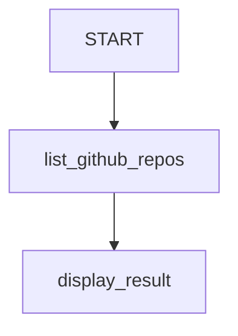

# GitHub OAuth Authentication Sample

## Overview

This sample demonstrates how to use `AuthConfig` with GitHub OAuth2 on a `FunctionNode` in a workflow. It shows how to pause execution to request a GitHub OAuth token from the user and then use that token to list the user's owned repositories via the GitHub API.

## Prerequisites

To run this sample and actually log in, you need to:

1.  **Register an OAuth Application on GitHub**:
    *   Go to your GitHub account settings.
    *   Navigate to **Developer settings** > **OAuth Apps** > **New OAuth App**.
    *   Set the **Homepage URL** and **Authorization callback URL** appropriate for your testing environment (e.g., `http://localhost:8000` if running locally).
2.  **Get Credentials**:
    *   Copy the **Client ID** and **Client Secret**.
3.  **Configure Environment Variables**:
    *   Set the following environment variables in your terminal before running the sample:
        ```bash
        export GITHUB_CLIENT_ID="your_actual_client_id"
        export GITHUB_CLIENT_SECRET="your_actual_client_secret"
        ```
    *   Alternatively, you can create a `.env` file in the sample directory (`contributing/workflow_samples/auth_oauth/.env`) with the following content:
        ```env
        GITHUB_CLIENT_ID="your_actual_client_id"
        GITHUB_CLIENT_SECRET="your_actual_client_secret"
        ```
        The ADK CLI automatically loads `.env` files from the agent directory.

## Sample Inputs

- "start"
- "list my repos"

## Graph



## How To

### 1. Define the AuthConfig for GitHub

We define an `AuthConfig` that specifies the GitHub OAuth2 endpoints and reads credentials from environment variables.

```python
auth_config = AuthConfig(
    auth_scheme=OAuth2(
        flows=OAuthFlows(
            authorizationCode=OAuthFlowAuthorizationCode(
                authorizationUrl="https://github.com/login/oauth/authorize",
                tokenUrl="https://github.com/login/oauth/access_token",
                scopes={
                    "user": "Read user profile",
                    "repo": "Access public repositories",
                },
            )
        )
    ),
    raw_auth_credential=AuthCredential(
        auth_type=AuthCredentialTypes.OAUTH2,
        oauth2=OAuth2Auth(
            client_id=os.environ.get("GITHUB_CLIENT_ID", "YOUR_GITHUB_CLIENT_ID"),
            client_secret=os.environ.get("GITHUB_CLIENT_SECRET", "YOUR_GITHUB_CLIENT_SECRET"),
        ),
    ),
    credential_key="github_oauth_token",
)
```

### 2. Apply to a Node

We apply the `auth_config` to the `list_github_repos` node.

```python
@node(auth_config=auth_config, rerun_on_resume=True)
def list_github_repos(ctx: Context):
    # ...
```

### 3. Call GitHub API

Inside the node, we retrieve the token and use the `requests` library to call the GitHub API.

```python
  cred = ctx.get_auth_response(auth_config)
  access_token = cred.oauth2.access_token if cred and cred.oauth2 else None

  # ... (headers setup) ...

  response = requests.get("https://api.github.com/user/repos", headers=headers)
  repos_data = response.json()
  repo_names = [repo["name"] for repo in repos_data]
```

## Running the Sample

To run this sample interactively, use the ADK CLI:

```bash
adk run contributing/workflow_samples/auth_oauth
```

Or use the Web UI:

```bash
adk web contributing/workflow_samples/
```
