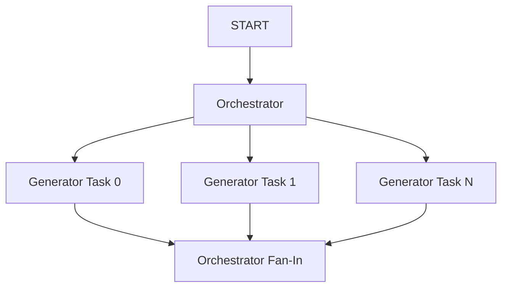

# Dynamic Fan-Out / Fan-In with Dynamic Nodes

## Overview

This sample demonstrates how to perform **Dynamic Fan-Out and Fan-In** using ADK's dynamic node scheduling (`ctx.run_node()`).

Unlike static graph-based parallel execution (which requires pre-defined branches), this pattern allows you to determine the number of parallel tasks at runtime based on the input data.

## Sample Inputs

- `AI, Cloud Computing, Quantum Computing`
- `Python, Go, Rust, TypeScript`

## Graph



## How To

Key techniques demonstrated in this sample:

1. **Dynamic Scheduling**: Using a loop to create tasks via `ctx.run_node()`.
2. **Context Isolation**: Using `sub_branch` in `run_node` to isolate events for each parallel task, preventing context contamination.
3. **`rerun_on_resume=True`**: Required on the orchestrator node to support resumption if any child node interrupts.

### Code Snippet

```python
    # Fan-out: Schedule a dynamic node for each topic
    tasks = []
    for i, topic in enumerate(topics):
        tasks.append(
            ctx.run_node(
                generator, 
                node_input=topic, 
                sub_branch=f"branch_{i}"
            )
        )
    
    # Wait for all tasks to complete
    results = await asyncio.gather(*tasks)
```

## Pro Tip: Custom `run_id`

ADK auto-generates numeric IDs (e.g., `@1`), but you can pass a custom `run_id` to improve log readability (e.g., `generator@task_AI`) or map events to business keys.

**Rules**:
- **Unique**: Must be unique per node for fresh executions (otherwise returns cached results).
- **Non-Numeric**: Must contain non-numeric characters to avoid collision with auto-generated IDs.
